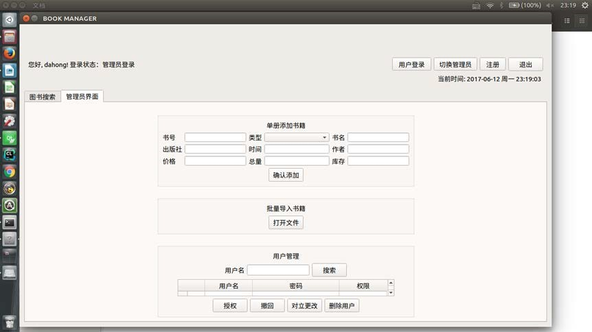
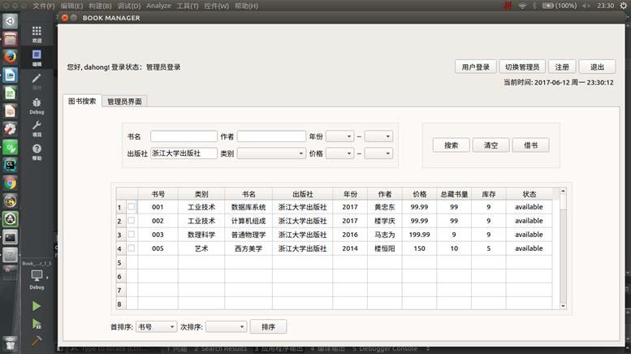
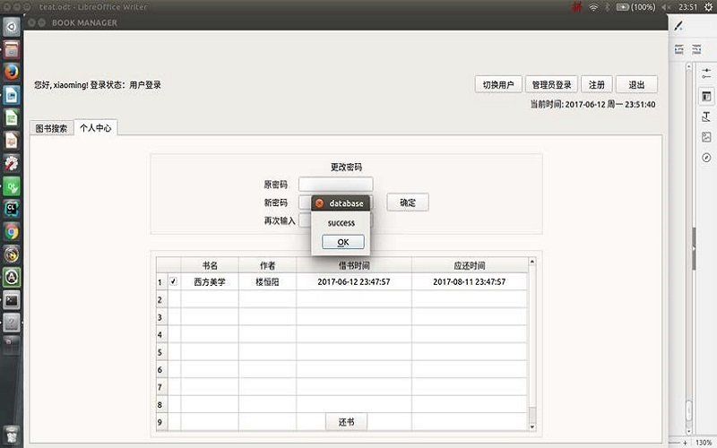
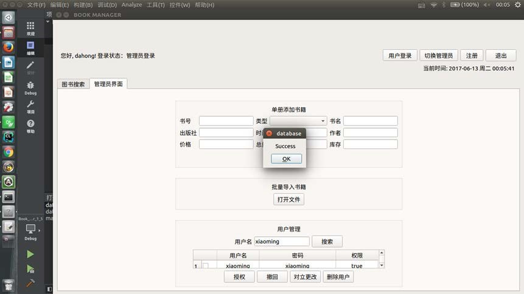
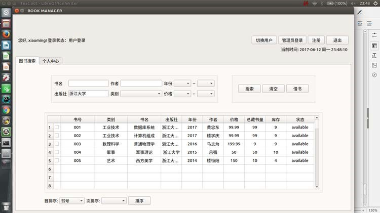

# Library Management System

## Dependency
> Qt (>5.7)

> Mysql 5.7

## Support
1. Account
- Adminstrator
    - [X] SignUp
    - [X] SignIn
    - [X] Switch
    - [X] Change permissions
    - [X] ……
- Users
    - [X] Similar to the above
2. Book
    - [X] Add
    - [X] Borrow
    - [X] Return
    - [X] Search
    - [X] ……

## Screenshots

